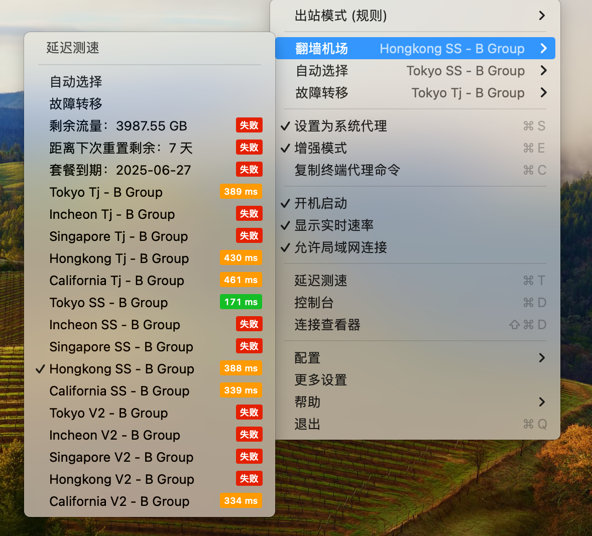
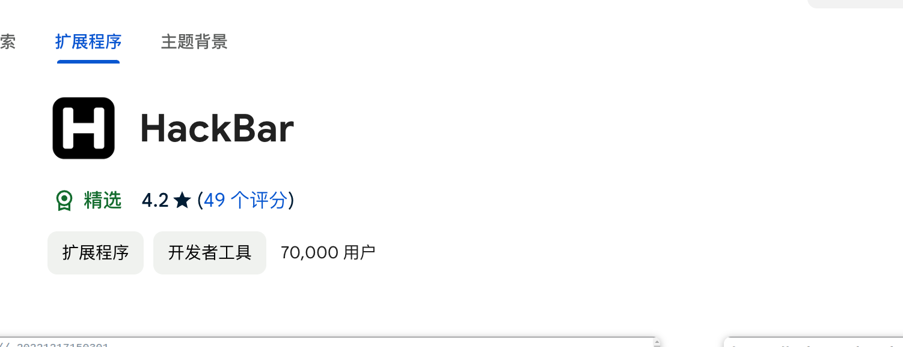

# task0

## 翻墙

## hackbar

## bp

使用yakit, 抓过二课的包

## 《提问的智慧》已读, 并且收录在了guide

<https://guide.cuit.dev/%E8%AE%A4%E7%9F%A5/%E5%A6%82%E4%BD%95%E6%8F%90%E9%97%AE/README-zh_CN.html>

## markdown语法, 会, 见guide
