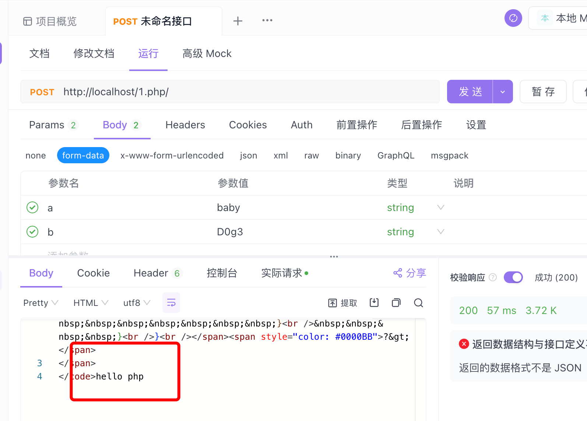
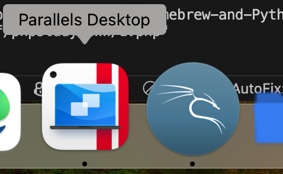
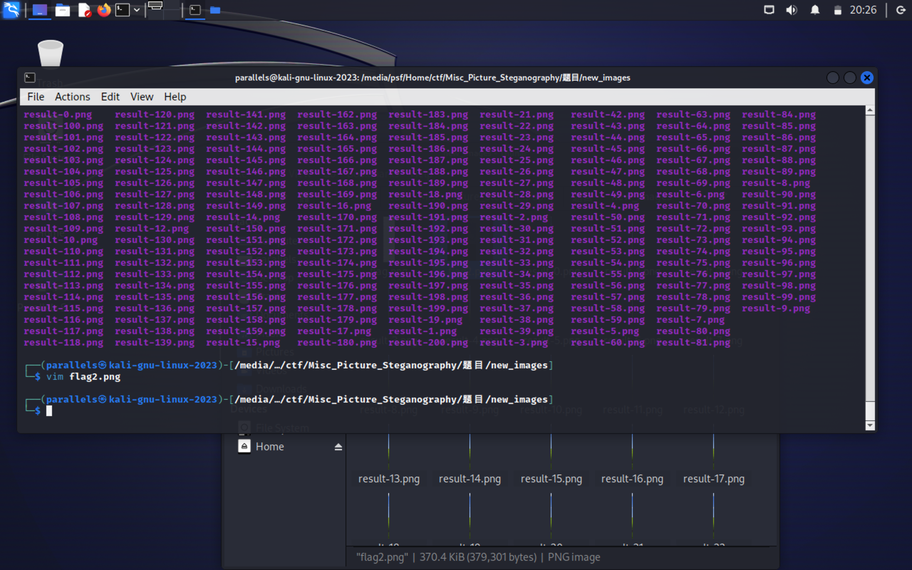

# task

## task1

1, 我是做前端的, http请求, 在与后端交互的时候常用, 学过;
客户端、服务端: 客户端是指用户端, 用户使用的设备, 比如你QQ使用的就是"客户端", 服务端就是QQ的服务器; phpstudy起的服务器就是本地服务端;
请求包、响应包: request/response
请求包、响应包的头（head）、体（body）get请求、post请求(特征以及区别): 见task2, 不多赘述;

各种响应码的含义: 4开头表示失败, 404表示未找到;

2, hackbar: 我下的有点小bug, 所以用apifox代替了;

3, robot.txt:

排除特定页面或目录：
网站管理员可以使用robots.txt来阻止搜索引擎的爬虫访问网站的某些部分。这通常是为了保护敏感信息或减少服务器负载。
指定sitemap：
robots.txt还可以包含指向站点地图（sitemap.xml）的链接，帮助搜索引擎快速找到网站的所有页面。
控制索引频率：
通过限制某些资源的访问，可以间接地影响搜索引擎对网站不同部分的索引频率。

对于恶意爬虫, 可以会忽略;

4, http相关伪造: 曾使用yakit抓包二课; 成功伪造请求实现了登录获取token报名签到等等功能;
目前可以通过在仅仅有学号的情况下登录二课;
细节的话可以私聊, 想基于此开发一个二课签到的项目, 后面因为我个人原因搁置; 目前只写完了请求接口;

## task2

这里使用前后端交互常用的apifox

额, 根据代码逻辑, 构造请求即可;

在params里面, a=welcome&b=to
body里面, a=baby&b=Dog3

## task3

## task4

虚拟机:

操纵目录: cd / pwd / 
读取文件: cat vim, 输出的话, 使用 > 