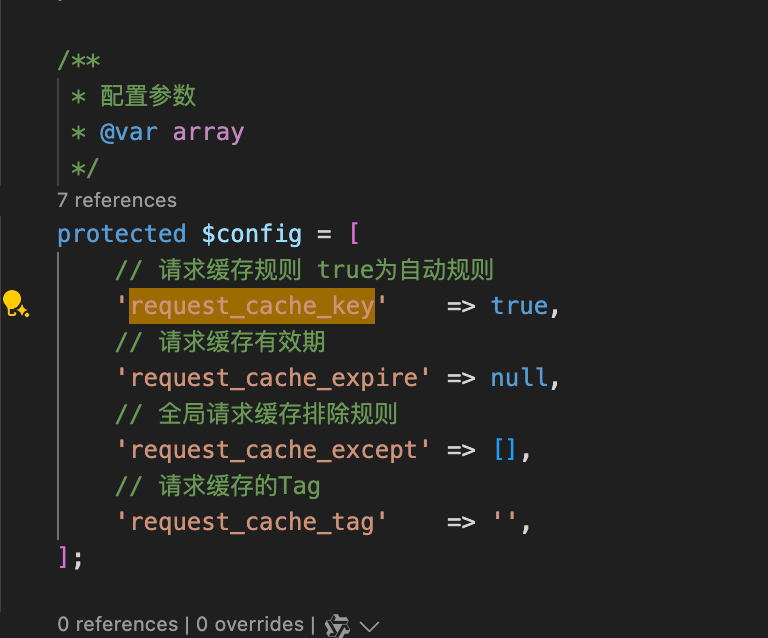
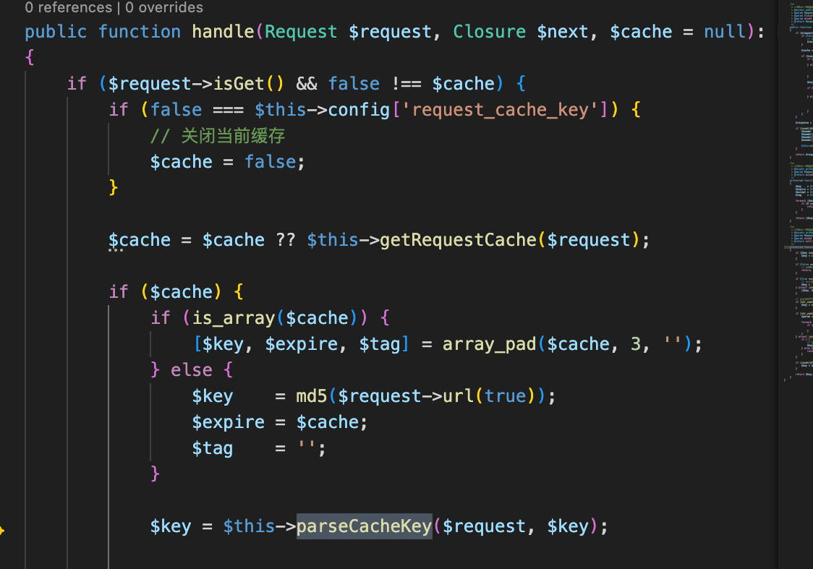
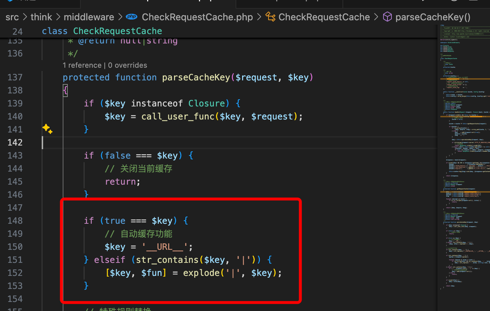
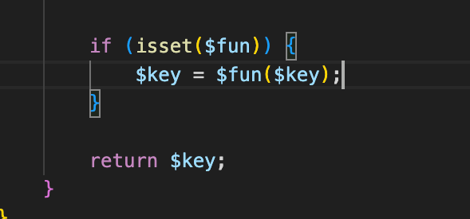

# thinkPHP框架漏洞

只有一个index.php, 以及没有缓存的时候打出来的: 'Welcome ,cache is disabled';

所以应该利用框架漏洞给它添加缓存;

直接去github下载源码来调试;搜索: request_cache_key;

直接搜请求缓存

发现这个$key可以直接影响url

所以在url中, 它会这样处理key;

他甚至不加过滤, 用$fun来执行key:

所以构造playload如下:

?isCache=cat /000f1ag.txt|system

## php语法

箭头: 在 PHP 中，箭头符号 -> 通常用于访问对象的属性或调用对象的方法。这是面向对象编程中的一种标准语法，用于引用对象的成员。

explode('|', $key); 分割字符;将$key用|来分割字符;

## 待学

<https://chenxi9981.github.io/ctfshow_XGCTF_%E8%A5%BF%E7%93%9C%E6%9D%AF/>

里面调试源码的能力;
