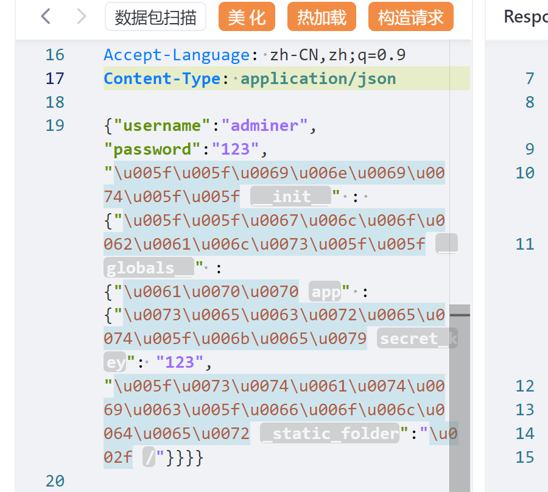

# python原型链污染

<https://www.cnblogs.com/Yolololo/p/18295135>

<https://chenxi9981.github.io/ctfshow_XGCTF_%E8%A5%BF%E7%93%9C%E6%9D%AF/>

<https://www.cnblogs.com/gxngxngxn/p/18205235>

“Python 原型链污染”指的是通过修改对象原型链中的属性，对程序的行为产生意外影响或利用漏洞进行攻击的一种技术。
在 Python 中，对象的属性和方法可以通过原型链来继承和获取。每个对象都有一个原型，原型上定义了该对象可以访问的属性和方法。当对象访问某个属性或方法时，会先在自身查找，如果找不到就会沿着原型链向上级查找。
常见的原型链污染攻击需要一个merge合并函数，通过递归合并来修改父级属性。

另一篇博客

<https://xz.aliyun.com/t/14620?time__1311=GqAhYK0KBK8D%2FD0ltdGQ3PwDIxWqxpD>

## 题目1

源码:

```python
from flask import Flask, session, redirect, url_for,request,render_template
import os
import hashlib
import json
import re
def generate_random_md5():
    random_string = os.urandom(16)
    md5_hash = hashlib.md5(random_string)

    return md5_hash.hexdigest()
def filter(user_input):
    blacklisted_patterns = ['init', 'global', 'env', 'app', '_', 'string']
    for pattern in blacklisted_patterns:
        if re.search(pattern, user_input, re.IGNORECASE):
            return True
    return False


# 检查是否存在属性或方法; hasattr() 函数用于判断对象是否包含对应的属性或方法。
# hasattr(object, name)
# 其中：
# object 是你要检查的对象。
# name 是一个字符串，表示你想要检查的属性或方法名。

# setattr(object, attribute, value)

# getattr 是 Python 的一个内置函数，用于从对象中获取属性


def merge(src, dst):
    # Recursive merge function
    for k, v in src.items():
        if hasattr(dst, '__getitem__'):
            if dst.get(k) and type(v) == dict:
                merge(v, dst.get(k))
            else:
                dst[k] = v
        elif hasattr(dst, k) and type(v) == dict:
            merge(v, getattr(dst, k))
        else:
            setattr(dst, k, v)


app = Flask(__name__)
app.secret_key = generate_random_md5()

class evil():
    def __init__(self):
        pass

@app.route('/',methods=['POST'])
def index():
    username = request.form.get('username')
    password = request.form.get('password')
    session["username"] = username
    session["password"] = password
    Evil = evil()
    if request.data:
        if filter(str(request.data)):
            return "NO POLLUTED!!!YOU NEED TO GO HOME TO SLEEP~"
        else:
            merge(json.loads(request.data), Evil)
            return "MYBE YOU SHOULD GO /ADMIN TO SEE WHAT HAPPENED"
    return render_template("index.html")

@app.route('/admin',methods=['POST', 'GET'])
def templates():
    username = session.get("username", None)
    password = session.get("password", None)
    if username and password:
        if username == "adminer" and password == app.secret_key:
            return render_template("flag.html", flag=open("/flag", "rt").read())
        else:
            return "Unauthorized"
    else:
        return f'Hello,  This is the POLLUTED page.'

if __name__ == '__main__':
    app.run(host='0.0.0.0', port=5000)

```

## 关于flash框架

### _static_folder

_static_folder 是一个内部属性，用于指定应用的静态文件存放目录。当创建 Flask 应用实例时，可以通过传递 static_folder 参数来设置这个目录

### __init__

__init__ 是一个特殊的方法，通常在类的实例化过程中调用。当创建一个类的新实例时，Python 解释器会自动调用 __init__ 方法来初始化新创建的对象。这个方法没有返回值，但可以接受参数，这些参数用于初始化对象的状态。

### __globals__

__globals__ 是一个特殊属性，它存在于每个模块的命名空间中，指向包含模块所有全局变量的字典。这个字典包含了模块中定义的所有全局名称，包括函数、类、导入的模块等。

例如：

## playload

```json
{"username":"adminer","password":"123","__init__" : {"__globals__" :{"app" :{"secret_key": "123","_static_folder":"/"}}}}
```

只给内容编码, 不涉及引号啥的; 



### unicode编码

python的原型链污染，需要把app.secret_key污染成一个我们想要的值，接着把 _static_folder的路径污染成服务器的根目录，实现任意文件读取从而得到flag。

过滤的绕过可以用 unicode 编码来绕，因为源码在检测waf后用了 json.loads 解析字符串，能识别 unicode。

在某些情况下，软件或系统可能只识别或过滤了常见的 ASCII 字符，而忽略了 Unicode 版本的字符。因此，攻击者可能会使用这些看似相同但实际上不同的 Unicode 字符来构造恶意输入，从而绕过安全检查。

例如，在 PHP 的 json_decode() 函数中，如果输入的 JSON 字符串中包含了一些特殊的 Unicode 字符，这些字符可能被误认为是合法的 JSON 格式的一部分，导致数据被错误地解析。这可能会引起安全漏洞，如注入攻击或跨站脚本（XSS）攻击。

## 题目2 ciscn国赛

<https://ctf.show/challenges#sanic-4328>

另一篇博客

<https://xz.aliyun.com/t/14620?time__1311=GqAhYK0KBK8D%2FD0ltdGQ3PwDIxWqxpD>

众所周知，cookie中的;被视为分隔符，正常传肯定失败，那我们就要去想想怎么绕过

既然是sanic的框架 我们自然会去搜sanic框架的源码 （cookies）
发现在sanic/cookies/request.py中的_unquote函数存在八进制解码的逻辑，且开头会去掉双引号 于是我们找到了绕过办法"\141\144\155\073\156"

```md
Cookie: user="\141\144\155\073\156"
```

源码:

```python
from sanic import Sanic
from sanic.response import text, html
from sanic_session import Session
import pydash
# pydash==5.1.2


class Pollute:
    def __init__(self):
        pass


app = Sanic(__name__)
app.static("/static/", "./static/")
Session(app)


@app.route('/', methods=['GET', 'POST'])
async def index(request):
    return html(open('static/index.html').read())


@app.route("/login")
async def login(request):
    user = request.cookies.get("user")
    if user.lower() == 'adm;n':
        request.ctx.session['admin'] = True
        return text("login success")

    return text("login fail")


@app.route("/src")
async def src(request):
    return text(open(__file__).read())


@app.route("/admin", methods=['GET', 'POST'])
async def admin(request):
    if request.ctx.session.get('admin') == True:
        key = request.json['key']
        value = request.json['value']
        if key and value and type(key) is str and '_.' not in key:
            pollute = Pollute()
            pydash.set_(pollute, key, value)
            return text("success")
        else:
            return text("forbidden")

    return text("forbidden")


if __name__ == '__main__':
    app.run(host='0.0.0.0')
```

## 好复杂, 后面再看
