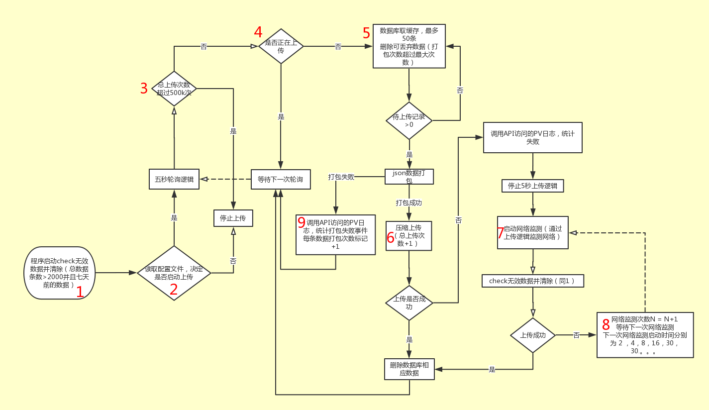

## 只在安卓和ios上使用的策略

流程：

1，清除无效数据，数据条数>2000并且时间超过一周的数据；
2，读取上传配置
3，开始五秒的轮询，设置上传的次数最大值；比如50w次；到达了最大值，则今天不再上传；
4，从数据库中读取缓存（50条），合并打包，上传次数+1
5，上传失败或者数据打包失败到一定次数，会暂停轮询逻辑；同时开始进行网络检测，网络监测采用”退步“的策略，比如2秒钟重试，然后4秒，8秒等等，最大30秒；

打包逻辑：数量/大小/时间

上报内容：
页面展现，页面关闭