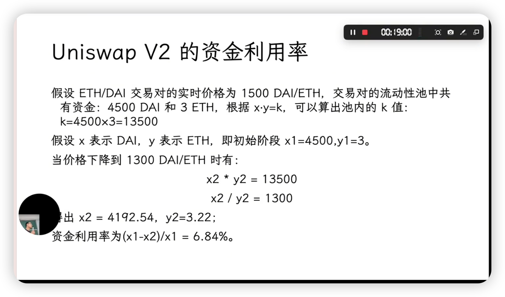
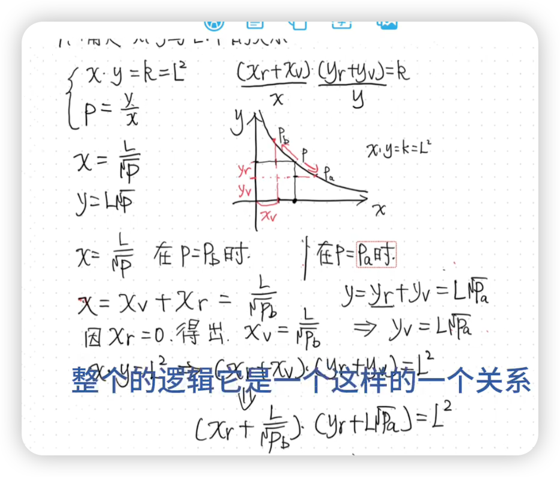
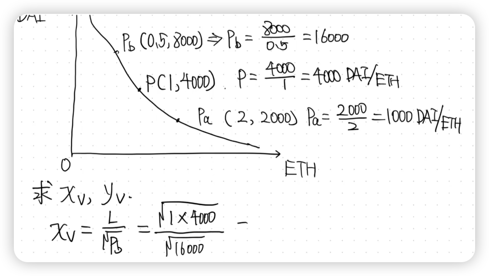

挂单：
- 买单
- 卖单

去中心化交易所 (DEX) ：指的是建立在区块链上、不依赖任何中心化机构来托管用户资金或撮合交易的交易所。所有交易都在链上通过智能合约完成。

AMM 是一种协议，它不使用订单簿，而是通过一个数学公式来自动为资产定价和执行交易。

意思就是 Uniswap v2 通过这个数学公式，创造出了一个无需人工干预、自动运行在区块链上的去中心化交易所。

DAI 是一种非常特殊的加密货币，它被称为“稳定币” (Stablecoin)。
核心特性： DAI 的价值被设计为与美元稳定挂钩，目标是让 1 DAI ≈ 1 美

流动性池，就是一个允许人们在高风险、高波动性的 ETH 和低风险、价格稳定的 DAI (美元) 之间自由买卖的市场。

展示当 ETH 相对于 DAI 的价格发生变化时，池子里的这两种代'币数量是如何根据 x * y = k 这个公式自动调整的。

#### v3的核心创新：集中流动性

###### Uniswap v2 的问题：分散的流动性
在 Uniswap v2 中，流动性提供者 (LP) 提供两种代币（例如 ETH 和 DAI），这些资金会被均匀地分布在从 0 到无穷大的整个价格曲线上。

- 想象一下： 你开了一家货币兑换店（ETH/DAI），你必须准备好应对任何可能的价格。无论是 1 ETH = 0.01 DAI，还是 1 ETH = 1,000,000 DAI，你都得有相应的资金储备。
- 问题所在： 对于像 ETH/DAI 这样的交易对，价格通常只在一个相对较小的范围内波动（比如 $1500 - $2500）。这意味着你存入的大部分资金——那些为极端价格（如 $1 或 $100,000）准备的资金——几乎永远不会被用到。这导致了极低的资本效率。

正如 Uniswap 官方文档指出的，在 v2 的 DAI/USDC 稳定币池中，只有约 0.5% 的资金被用于 $0.99 到 $1.01 这个最常发生交易的价格区间。剩下的 99.5% 的资金都在“沉睡”，无法赚取手续费。

###### Uniswap v3 的解决方案：集中流动性

Uniswap v3 的核心创新是“集中流动性”。

在 v3 中，流动性提供者 (LP) 可以指定他们愿意提供流动性的价格范围。例如，一个 LP 可以决定只提供 $1,000 到 $1,100 之间的流动性，而不是在整个价格曲线上提供。

这就像你只开了一家专门针对 $1,000 到 $1,100 这个价格区间的货币兑换店。

- 回到兑换店的比喻： 你不再需要为所有可能的价格做准备。你可以根据你的判断，只为最可能成交的价格区间提供流动性。
- 比如，你预测未来一周 ETH 的价格会在 $3000 到 $3500 之间波动，于是你就可以把所有资金都集中在这个区间内。
    - 极高的资本效率 (Capital Efficiency): 你只需要为最可能发生交易的价格区间提供流动性，而不是为所有可能的价格做准备。
    - 为交易者提供更好的价格 (Deeper Liquidity): 你提供流动性的价格区间越深，交易者可以找到的流动性就越多，价格滑点就越低。

集中流动性是 Uniswap v3 的灵魂。它把资本配置的权力从协议本身交还给了流动性提供者，让他们可以像专业的做市商一样，根据自己对市场的判断来精准地部署资金。

###### 滑点 (Slippage)
滑点，简单来说，就是你期望的成交价格与最终实际的成交价格之间的差额。

一个生活中的比喻：
想象一下，你在网上看到一件商品标价 100 元，你点击了“立即购买”。但在你完成支付的短短几秒钟内，由于商品太火爆，商家将价格上调到了 101 元，你最终支付了 101 元。这多出来的 1 元，就是你的“滑点”。

#### x,y 与 L,P

P = y / x
x是基础货币，这是你想要买入或卖出的“商品”。
y是计价货币，这是你用来为“商品”定价和交易的货币。

为了获取一个线性的结果，引入L^2：

$$
\begin{align*}
    x \cdot y &= k = L^2 \\
    y &= p \cdot x \\
    \\
    \Rightarrow \quad L &= x \cdot \sqrt{p} \\
    \\
    x &= \frac{L}{\sqrt{p}} \\
    y &= L \cdot \sqrt{p}
\end{align*}
$$

$$
(x + \frac{L}{\sqrt{p_b}})(y + L\sqrt{p_a}) = L^2
$$
(真实x + 虚拟x) * (真实y + 虚拟y) = L²

L/√p_b的作用：设置价格曲线的边界
- 设置价格上限。它是一个数学偏移量，确保当你的真实 Y 代币耗尽时，价格恰好为 p_b。
- 设置价格下限。它是一个数学偏移量，确保当你的真实 X 代币耗尽时，价格恰好为 p_a。

#### 范围订单 (Range Order)

简单来说，范围订单是利用 v3 的集中流动性机制，来模拟传统交易所中的“限价单” (Limit Order) 的一种策略。

