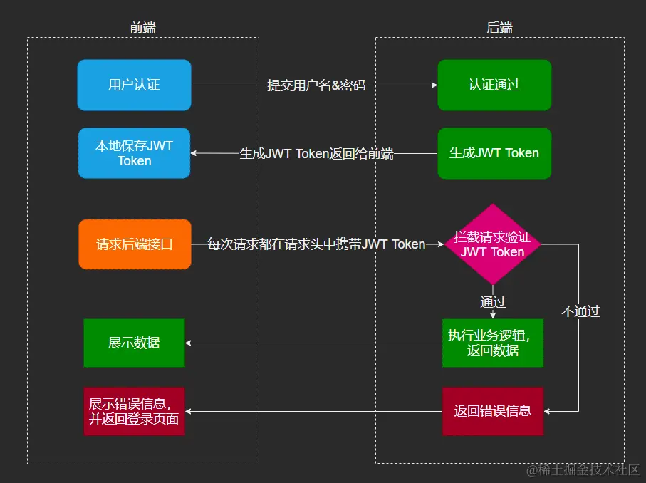

## 如何记录请求

- 服务端存储 session + cookie
  - 给每个请求打上标记，然后在服务端识别标记从而获取数据；
- 客户端存储 jwt token 方案

cookie：

- 存储在客户端的小型文本文件
- 每次请求都会自动发送到服务器

session：

- 存储在服务端的用户会话信息
- 通过 session Id 与客户端进行关联

### cookie + session 的缺陷

- cookie 容易被窃取
- 可能会因为网站跳转的时候，带上了 cookie，从而触发 CSRF 问题；（可能在同域下， 所以cookie的domin属性也不能避免）
  - 解决方式 验证 referer
  - 最终解决方案：使用一个随机值返回，后面的请求必须带上这个随机值才行；这个随机值就是 token（比如 csrf-token）


- 服务器集群：对于微服务架构，因为 session 是存在服务端的，如果有服务器集群，就会出现同步问题；

解决方式是：
  - 服务器同步 session
  - 使用 redis 来存 session，每次用的时候都从 redis 去查
  - 跨域问题，只有相同域名才会带上 cookie；

### JWT json web token

三个部分：
- header 保存加密算法
- payload 具体数据
- signature 数字签名（header+payload+salt）

```sh
authorization: Bearer xxxxx.xxxxx.xxxx
```

好处是： 没有CSRF，分布式session，以及跨域问题；
缺点：
- 安全性，没有用https，让对方拿到了header
- 存储在客户端，没法直接让它失效（踢人，退出登录，改完密码下线）
  - 解决方式：在redis中记录一下token的生效状况
- 传输内容多了，性能更差

