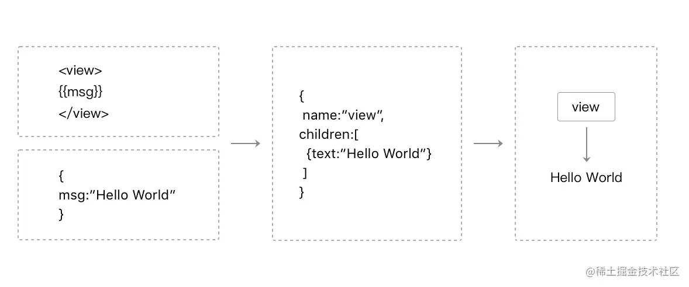

# 小程序原理

文章地址: <https://juejin.cn/post/7140509513852911647?searchId=202410102025582E721D26269A01AF3D2A>

## 双线程架构:

两个线程, 一个线程负责渲染, 一个线程负责事件处理;
逻辑层使用jscore运行逻辑, 视图层使用webview渲染;
两个线程之间由Native 层之间统一处理，无论是线程之间的通信，还是数据的传递，网络请求都是由Native层做转发。

### 数据驱动

通过通过对比视图层的数据和逻辑层的数据，更新视图层;


因为小程序基于双线程模型, 任何数据传递都是线程之间的通信

所以,**一切都是异步**

### PageFrame

用调试工具可以看到两个webview, 一个是当前页面的,一个是pageframe/instanceframe.html;

小程序会预先加载一个html模版, 然后打开某个页面的时候,只需要提取它的几个属性, 将这些属性数据通过 `jsbridge` 注入到模版, 模版会渲染出页面;

::: tip
jsbridge 是小程序与宿主之间的通信方式, 宿主可以是微信, 抖音, 头条, 支付宝等;
js代码通过jsbridge可以调用微信小程序的原生接口, 比如打开摄像头, 获取用户信息等;
:::

### 快速启动

小程序限制十个页面, 所以路由不能嵌套太深

首次启动的时候,会新通过pageframe生成内容, 后台服务会缓存;后续都会走缓存;

```md
因此webview 路径变化为
http://127.0.0.1:${global.proxyPort}/aboutblank?${c}
http://127.0.0.1::63444/__pageframe__/instanceframe.html
http://127.0.0.1:63444/__pageframe__/pages/index/index
```
正好对应了webview的加载过程


### WebComponents

主要用于web开发; 小程序没有直接实现它, 而是直接通过Exparser实现;
- 允许自定义元素标签
- shadow dom: 隔离DOM树, 防止污染; 同时可以隐藏dom树的样式;
    组件化：小程序通过自定义组件实现了类似于 Web Components 的组件化开发。每个组件都有自己的模板、样式和逻辑。
    样式隔离：小程序组件的样式默认是局部的，不会影响其他组件或页面。这与 Shadow DOM 的样式隔离特性类似。
- 支持模板, 样式, 脚本分离;

### Exparser框架

就是用于在小程序中实现组件化开发; 其组件模型与WebComponents的shadow dom模型一致;

- 基于shadow dom, 实现组件树;
- 可以在纯js环境中运行

小程序中，所有节点树相关的操作都依赖于Exparser，包括WXML到页面最终节点树的构建和自定义组件特性等。

### 原生组件

以下是客户端创建的原生组件: 
camera
canvas
input（仅在 focus 时表现为原生组件）
live-player
live-pusher
map(地图组件)
textarea
video