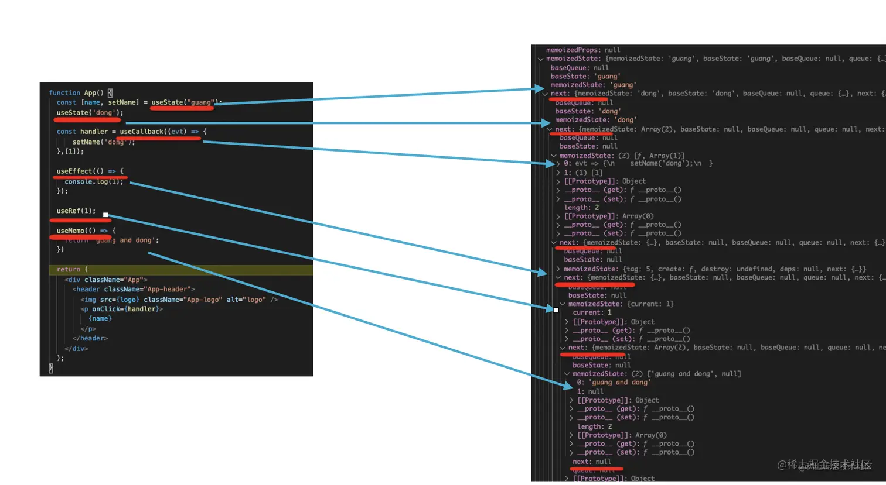

# React原理

## React理念：
代数效应：将`副作用`从`函数`中抽离出来
- 计算效应的分离：将程序的"做什么"（纯逻辑）和"如何做"（副作用）分开处理。（hooks，以及Suspense机制）
- 可组合性：允许以模块化方式组合和处理副作用
- 声明式处理副作用：以声明方式定义和处理副作用，而不是命令式（在useEffect中请求，而不是直接请求）
- 续体：可中断，且可以保存当前状态。（Fiber架构，可中断的更新。Suspense"暂停"渲染，等待某些异步操作完成）

React依赖管理：
- 就是无自动依赖追踪，都是手动依赖追踪，然后在setState的时候进行组件级的更新；

## Fiber架构：
哈啰的文章，其实也是一样，很多细节都没讲出来：<https://mp.weixin.qq.com/s/q70TMZ5jJcOCJpHOWndo8A>
卡颂的文章，其实讲的不好，太笼统：<https://react.iamkasong.com/process/reconciler.html>
需要二者结合着看，填充细节；

### React16之后的Fiber架构：
- 调度器: Scheduler，调度任务优先级
    - 放弃浏览器的api，自己实现的`requestIdleCallbackpolyfill`来作为scheduler
    - 有类似于os的那种时间片机制，以此来避免卡顿；
- 协调器： Reconciler 负责找出变化的组件, 打上标签；
    - render阶段（更应该叫Reconcile，协调阶段）
        - beginWork：处理当前节点的工作， 给每个节点打上tag， 然后commit阶段统一更新；
        - completeWork：为每个节点调用completeWork方法；
        
        - 双缓存Fiber 通过alternate指针切换虚拟dom树（在layout阶段切换）
        - 收集effect，构建副作用链表（effect list）
        - 放弃递归，使用循环编写，可中断；
        

- 渲染器： Renderer（不同的环境有不同的render， 比如ReactDom， 比如Native）（批处理， 统一更新）
    - commit阶段：负责将虚拟dom渲染成真实dom；
        - BeforeMutation阶段：异步调度useEffect的回调函数
        - Mutation阶段：更新dom，处理ref，清理副作用
        - Layout阶段：同步执行useLayoutEffect的回调函数

<https://juejin.cn/post/7184747220036485177>



如上图，其中memoizedState就是我们存放hooks数据的地方。它是一个通过 next 串联的链表。

### 一些概念：Fiber是什么？是React新的架构，也是一种新的协调算法；

React将渲染过程拆解成了一些Fiber节点

Fiber将更新过程拆解成一些小任务，并且采用一定的**优先级管理**，来决定渲染顺序；

#### Fiber的结构：

- 作为静态单元来说，储存了ReactElement的节点信息
- 作为动态单元来说，它储存了（本次更新相关的信息）节点的变动tag（增加/删除 操作等等）


#### 如何更新dom？

#### 什么是双缓存？

比如在canvas中，每一帧都要清理上一帧的内容，并且进行下一帧的绘制；如果其中有比较大的间隙，就会出现白屏；

有的Scheduler和Reconciler都在内存中绘制，绘制完了统一交给渲染器渲染出来；这种方式就叫做**双缓存**；

#### 双缓存Fiber树

当前屏幕显示的是current fiber树，正在内存中的是 workInProgress fiber树； 

二者的fiber节点通过alternate连接

在mutation之后，通过current指针的指向，来完成不同fiber树的切换；

### Scheduler计时器
`requestIdleCallback`是浏览器提供的一个API，用于在浏览器空闲时执行任务；
但是它有些缺陷，比如无法准确返回剩余时间，无法设置优先级等等；
所以React放弃了浏览器的API，自己实现了一个`requestIdleCallbackpolyfill`来作为scheduler；
这个scheduler有类似于os的那种时间片机制，以此来避免卡顿；


### render阶段（Renconciler, 协调阶段）

这或许是fiber架构的设计目标，实现基于优先级的可中断渲染；
performUnitOfWork负责执行单个节点的工作；
在performUnitOfWork中，当有更高优先级的的渲染任务到来时，React可以中断当前任务，将其压入栈中，后续可再恢复到中断的地方继续执行；

```js
const performUnitOfWork=(fiber)=>{

    // 处理当前节点的工作
    beginWork(fiber);

    if(fiber.child){
        return fiber.child;
    }

    let nextFiber = fiber;
    while(nextFiber){
        completeWork(nextFiber);
        if(nextFiber.sibling){
            return nextFiber.sibling; // 处理下一个兄弟节点
        }
        nextFiber = nextFiber.return; // 返回到父节点
    }
    return null; // 完成所有工作
}
```

#### ”递“，处理当前节点的工作，一直到叶子节点；

为遍历到的每个Fiber节点调用**beginWork** 方法。

##### beginWork


1. 进行虚拟dom diff算法，比较给不同的节点打上不同dom操作类型 tag的标记
- 如 Placement、Update、Deletion 等
- 这些标记告诉 commit 阶段需要执行哪些 DOM 操作
- beginWork方法创建子节点；

2. 同时它也会遍历所有的hook，形成单向链表，挂载到fiber的memorizedState上；
update的时候，会根据hook的顺序，依次调用；

3. 根据**当前**节点的tag，调用不同的工作单元函数，来创建节点
- FunctionComponent：调用函数组件的执行函数，获取返回的ReactElement；
- ClassComponent：调用类组件的render方法，获取返回的ReactElement；
- HostComponent：创建真实DOM节点；
- HostText：创建文本节点；
- HostRoot：创建根节点；
- ContextProvider：创建Context.Provider节点；
- ContextConsumer：创建Context.Consumer节点；
- Fragment：创建Fragment节点；
- Mode：创建Mode节点；

#### ”归“，

为每个节点调用**completeWork**方法；

如果有兄弟节点，会**优先更新**兄弟节点；如果没有，则return到父节点；

##### completeWork

1. 根据tag完成dom节点的创建工作；

2. 收集所有带副作用的hook，形成effect list；并且拼接到父节点的effect list上；

3. effect还会标记副作用类型
```ts
const effect = {
  tag: effectType,  // 如 Passive（useEffect）或 Layout（useLayoutEffect）
  create: () => {},  // 副作用回调函数
  destroy: () => {}, // 清理函数（由 create 返回）
  deps: [],          // 依赖数组
  next: null,        // 指向下一个 effect
};
```


### commit阶段

#### BeforeMutation阶段
主要是 异步调度 useEffect 的回调函数，执行DOM操作之前；

useEffect的回调是异步的，会在浏览器绘制完成的时候执行；

别的看不懂
<https://react.iamkasong.com/renderer/beforeMutation.html#%E8%B0%83%E5%BA%A6useeffect>

#### Mutation阶段
- 更新dom
    - 插入DOM节点（Placement）
    - 更新DOM节点（Update）
    - 删除DOM节点（Deletion）
- 处理ref
- 清理副作用

#### Layout阶段

同步执行 useLayoutEffect 的回调函数，在layout阶段同步执行；

异步执行 useEffect 的回调函数， 在浏览器绘制完成后执行；

### 一些概念以及问题

#### 副作用是什么？
React组件本质是纯渲染组件，副作用指与外部交互的

比如操作dom、请求数据、订阅事件等等

#### requestIdleCallback polyfill (Sheduler)

这东西的作用是可以在浏览器空闲的时候执行任务，触发回调；

并且获取剩余时间（timeRemaining()），可以设置优先级；

（这东西，类似于os的设计）

不被使用的原因：
- 浏览器兼容性问题，而且不同浏览器的实现不一样，而且需要与Reconcile进行精细化的协作；
- 无法准确返回剩余时间
- 无法设置优先级，无法实现抢占式调度，（React内部的优先级是 交互 > 动画 > 数据加载）
需要出现用户点击的时候，当前时间片需要立刻停止，需要抢占式的调度；
- 避免饥饿，低优先级的任务不会一直被忽略；   

#### 为什么要引入Fiber架构？

就是有调度器，可中断的可抢占的具有优先级的调度器；

#### React做过哪些优化？（特别像os）

- 双缓存dom树
- 优先级调度器
- diff算法优化
- 异步批处理统一更新

#### useEffect和useLayoutEffect的区别？

useEffect是异步的，useLayoutEffect是同步的；
useEffect是在commit阶段执行，useLayoutEffect是在layout阶段执行；

​DOM 布局依赖操作：如测量元素尺寸（offsetWidth）、调整元素位置或样式，避免渲染闪烁。
​同步状态更新：需要基于 DOM 状态立即更新的逻辑（如滚动位置恢复）。