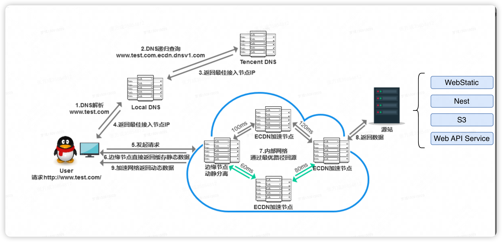

## 埋点策略

### 埋点上报，用户量非常大，观察用户行为是否有问题时，如何处理会比较好?思路是什么？

#### 采样策略：
- 分层采样：根据用户类型分层
- 降频采样：对高频事件进行降采样，如只收集10%的页面浏览事件

#### 前端性能优化
- 批量上报
- 使用 requestIdleCallback/setTimeout：在浏览器空闲时发送，避免影响主线程
- 设置上报阈值：达到特定条件（数量/时间）再触发上报
- 压缩数据：使用 gzip/Brotli 压缩上报数据

#### 分层存储
- 热数据：最近1-7天数据存入高性能存储（如Redis）
- 温数据：7-30天数据存入列式数据库（如ClickHouse）
- 冷数据：30天以上数据归档至对象存储（如S3）

#### 可视化
- 面板实时监控、智能告警
- 分析用户行为路径

#### 常见问题与解决方案
- 数据量过大导致性能问题
    - 实现智能采样，根据用户特征动态调整采样率

- 数据延迟问题
    - 关键指标实时上报，非关键指标批量延迟上报
    - 实现离线缓存，网络恢复后再上报

### 性能指标采集怎么做的？有哪些关键的性能指标？用户行为监控是怎么做的？

- DOM Ready：只有html dom树，没有css、图片、iframe等等
- LCP时间：最大的那块图片加载完毕的时间。视口（viewport）内可见的最大的图像或文本块完成渲染的时间点。
- 页面完全加载的时间：window.onload 事件，不仅 HTML 和同步脚本完成了，页面所依赖的所有资源，包括样式表、所有图片、iframe等，都已经全部加载完成的时间点
- 首屏时间：它关注的是用户第一眼看到的所有东西
    - 通常通过 MutationObserver 监听首屏内 DOM 的变化，并记录最后一个元素（特别是图片）加载完成的时间
- 接口耗时

DOM Ready：骨架好了，可以交互了。
LCP：主要内容出来了，感觉页面可用了。
首屏时间：第一眼看到的东西都出来了。
页面完全加载：所有东西都加载完了，页面彻底安静了。

链路图：
境外用户
访问香港/法兰克福  -> 到北京服务器专线 -> 服务器托管平台 -> 应用

