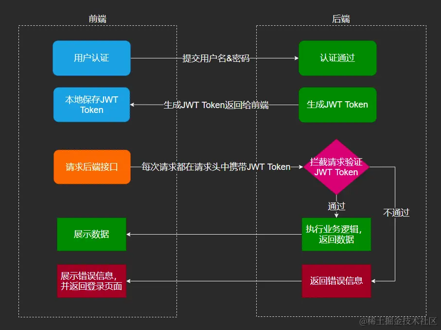

# Token、Cookie、Session 认证机制详解

## 认证方案对比

### 传统 Session + Cookie 方案
- **服务端存储**：生成并在服务端存储 sessionid，存储在 cookie 中并返回
- **请求携带**：每次请求都携带 sessionid
- **验证方式**：给每个请求打上标记，服务端识别标记获取数据

### JWT Token 方案
- **客户端存储**：用户信息加密在 JWT token 中
- **无状态验证**：服务器不需要存储会话信息
- **跨域友好**：天然解决跨域问题

在分布式架构中，Session 方案有同步以及跨域（cookie 只能在相同域名下）的问题，JWT 方案则天然可以解决跨域。

## 基础概念

### Cookie
- 存储在客户端的小型文本文件
- 每次请求都会自动发送到服务器
- 受域名限制，只能在相同域名下使用

### Session
- 存储在服务端的用户会话信息
- 通过 session ID 与客户端进行关联
- 需要服务器维护状态

### JWT (JSON Web Token)
三个部分组成：
- **Header**：保存加密算法信息
- **Payload**：具体的用户数据
- **Signature**：数字签名（header + payload + salt）

使用方式：
```sh
Authorization: Bearer xxxxx.xxxxx.xxxx
```

## Cookie + Session 的缺陷

### 安全问题
- **Cookie 容易被窃取**：存储在客户端，容易被 XSS 攻击获取
- **CSRF 攻击风险**：网站跳转时自动携带 cookie，可能触发跨站请求伪造
  - 解决方式：验证 referer 字段
  - 最终解决方案：使用 CSRF Token（随机值验证）

### 架构问题
- **服务器集群同步**：微服务架构中 session 存储在服务端，集群间需要同步
- **跨域限制**：只有相同域名才会带上 cookie

### 解决方式
- 服务器间同步 session
- 使用 Redis 存储 session，统一查询
- 配置 cookie 的 domain 属性

## JWT Token 的优缺点

### 优点
- **无 CSRF 风险**：需要手动在 Header 中添加，不会被自动发送
- **分布式友好**：无状态验证，任何服务器都能验证
- **跨域支持**：不受域名限制

### 缺点
- **安全性依赖 HTTPS**：没有 HTTPS 时容易被窃取
- **无法主动失效**：存储在客户端，服务端无法直接让其失效
  - 解决方式：在 Redis 中记录 token 的生效状况
- **传输开销大**：包含用户信息，传输内容较多

## 单点登录（SSO）实现

### 基本概念
单点登录是中心化的登录方式，用户只需登录一次即可访问多个相关应用。

### 传统 SSO 实现
1. **中心认证服务器**：统一的身份验证中心
2. **首次登录**：验证用户信息，生成 sessionID
3. **服务端存储**：将 sessionID 存储在服务端
4. **Cookie 返回**：将 sessionID 存储到 cookie 中返回给客户端
5. **后续请求**：每次请求携带 cookie，过期时重定向到认证中心

### 子域名访问策略
- **Cookie 域名设置**：各子域名维护自己的 cookie，避免安全攻击
- **重定向机制**：登录过子域名 A 后访问子域名 B，根据 cookie 共享策略决定是否重定向

## 现代 SSO：双 Token 无感刷新机制

### Token 类型
- **Access Token**：短期有效（通常 15-30 分钟），用于日常 API 请求
- **Refresh Token**：长期有效（通常 7-30 天），用于刷新 Access Token

### 无感刷新触发时机
1. **被动刷新**：服务端返回 401（未授权访问）时自动刷新
2. **主动刷新**：Access Token 快要过期时提前刷新

### 刷新机制
1. **检测过期**：客户端检测到 Access Token 过期或即将过期
2. **使用 Refresh Token**：向认证服务器发送刷新请求
3. **获取新 Token**：服务器验证 Refresh Token 后返回新的 Access Token
4. **Token 轮换**：同时生成新的 Refresh Token，旧的立即失效
5. **重试请求**：使用新 Token 重新发送原始请求

## 企业级应用中的 Token 类型

### ct_token（CSRF Token）
- **作用**：防止跨站请求伪造攻击
- **工作原理**：
  - 服务器生成随机 token 嵌入页面
  - 用户提交表单时携带该 token
  - 服务器验证 token 是否与之前生成的相同
- **特点**：
  - 一次性使用，每次都重新生成
  - 与用户会话绑定
  - 具有时效性

### session_token（会话令牌）
- **命名延续**：延续了传统"会话存储"的概念
- **实际本质**：现代实现中通常是 JWT Token，而非传统 Session
- **主要功能**：
  - 维持用户会话状态
  - 身份识别和权限验证
  - 跨应用访问控制

### Refresh Token 刷新策略

#### Token 轮换模式（推荐）
- **每次刷新**：生成新的 Access Token 和 Refresh Token
- **旧 Token 失效**：旧的 Refresh Token 立即失效
- **安全性高**：防止 Token 被长期滥用

#### 刷新流程
1. **发送刷新请求**：携带当前 Refresh Token
2. **服务器验证**：检查 Refresh Token 有效性
3. **生成新 Token**：创建新的 Access Token 和 Refresh Token
4. **返回响应**：返回新的 Token 对
5. **客户端更新**：更新本地存储的 Token

#### 安全考虑
- **并发控制**：防止多个请求同时触发刷新
- **异常处理**：Refresh Token 过期时引导用户重新登录
- **监控告警**：异常刷新行为的检测和处理

## 最佳实践

### 安全存储
- **Access Token**：存储在内存中，页面刷新后重新获取
- **Refresh Token**：存储在 HttpOnly Cookie 中，防止 XSS 攻击
- **CSRF Token**：嵌入表单或请求头中

### 多层防护
- 结合多种认证机制
- 实施内容安全策略（CSP）
- 定期轮换和更新 Token
- 监控异常访问行为

