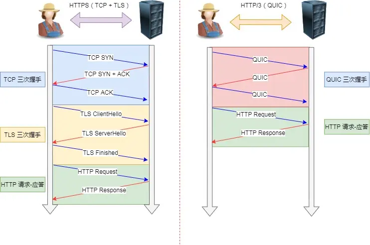

HTTP/1 -> HTTP/1.1：默认开启 `Connection: keep-alive` 支持长连接与 TCP 连接复用

HTTP/1.1 -> HTTP/2：二进制协议，支持了 HPACK(Huffman) Header 压缩，支持多路复用，与长连接（1.1只支持整体传输，而 HTTP/2 支持分帧传输）。支持了服务端推送，在客户端请求之前推送资源

HTTP/2 -> HTTP/3：基于 QUIC 实现，拥有 QUIC 的优点：连接迁移、高效拥塞控制


#### http123

揭秘http2：<https://mp.weixin.qq.com/s/tG6HPSuGEOxpS9lq-Q_uLg>

##### http1.0
在http1.0中，请求和响应不支持“管道 pipe”，一次只能发送一个，一问一答。
一个请求完成才能进入下一个请求，如果出现等待，则后续也要等待；
http1.0 采用短链接，每次请求都要建立一次连接，请求完成后关闭连接。


##### http1.1

引入了持久链接，但是，在效率不佳的情况下仍然有效率问题。

> 队头阻塞：一个请求或者响应阻塞，则后续请求或者响应也要阻塞；

通常会为浏览器开多个并行的tcp连接，带来额外的开销。

##### http2
http2牛逼在哪？ <https://xiaolincoding.com/network/2_http/http2.html>

基于https
完全基于tcp构建，
- 头部压缩
    - 采用hpack算法压缩头部，减少头部大小；（客户端和服务端同时维护一张表，后续只发送索引号）
- 二进制，分帧
    - 头信息和数据体是分开传输的，通过帧的标志位来区分，并采用二进制格式编码
- 并发传输 多路复用（steam、pipe管道）
    - 在同一个tcp连接中，引入了steam的概念，可以同时发送多个请求和响应，解决了http1.1的队头阻塞问题；
    - 重传机制，如果丢包了，就会重传（tcp的特性）。
- 服务器主动推送资源（sse）


###### 多路复用

- Steam：一个连接中可以有多个stream，一个stream中可以有多个帧；
    - 帧：帧是http2中传输的最小单位，一个帧中包含帧头和帧体；
    - 帧头：帧头中包含帧的标志位、流标识符、长度等信息；
    - 帧体：帧体中包含请求或响应的数据；

并且，同一个stream中的帧可以乱序发送，每个都有一个唯一的steamId，接收方再自行组装。

###### 依然有队头阻塞的问题
http2通过多路复用的方式，解决了应用层的队头阻塞，但是在传输层，tcp协议本身存在队头阻塞的问题: 

所有http2流会被合并成单一字节流。
少量丢包，就会导致所有请求延迟（所有的包都必须等待这个包传回来）。
```text
TCP流: [A1][B1][C1][A2][B2][C2][A3][B3][C3]
                    ↑
              如果这个包丢失
                    ↓
所有后续包被阻塞: [A3][B3][C3] 必须等待 [B2] 重传
```

###### http2的问题
- 队头阻塞
    - 多路复用只是在应用层，但是在传输层的tcp中，如果其中一个序列号的数据断了，别的数据也无法完整读取出来。只能等它重传。所以也存在队头阻塞问题。
- TCP 与 TLS 的握手时延迟；
    - 还需要tcp三次握手和tls握手
- 网络迁移需要重新连接；
    - tcp的连接按照这个四元组来看的，变了就要重新连接：`[源 IP 地址，源端口，目标 IP 地址，目标端口]`


##### http3

- 底层协议更改：tcp ——> 基于udp的quic协议

优点：
    - 没有队头阻塞：quic的一个流丢失了，只会影响自己。
    - 连接更快（只需要握手两次，且包含了tls）
    - 连接迁移
        - tcp中，切换网络（4G到Wifi），需要重新建立连接。
        - quic中，切换网络，不需要重新建立连接。
            - 使用新的id，而不是四元组，所以即使切换了，但是
    - 伪http2+tls+多路复用协议
    - 



##### SSL/TLS 协议基本流程：


###### 加密算法
- 非对称加密
    - 公钥加密，私钥解密：确保内容捕获不会被泄露
    - 私钥加密，公钥解密：确保内容不会被篡改
- 内容不被篡改
    - 哈希可以防篡改。
    - 但是，哈希不能防替换，所以要使用数字签名技术（上文的对称、非对称混合加密）。


###### 状态码
- 1xx：信息性状态码，表示请求正在处理中，需要客户端继续等待。
- 2xx：成功状态码，表示请求成功。
- 3xx：重定向状态码，表示请求需要进一步操作。
    - 304：协商缓存表示资源未修改
- 4xx：客户端错误状态码，表示请求有误。
    - 401：未授权，需要重新登录
    - 403：越权，拒绝访问，没有权限
    - 404：notfound，未找到资源
    - 405：方法不允许
    - 406：不接受
    - 407：需要代理认证
    - 408：请求超时
    - 409：冲突
    - 410：已删除
    - 411：长度要求
    - 412：先决条件失败
    - 413：太大。请求实体太大 （比如cookie超了）
    - 414：请求URI太长
- 5xx：服务器错误状态码，表示服务器处理请求时出错。


#### 问题
- 点对点指的哪一层?
    - 点对点：数据链路层，指网络中两个相邻节点之间的通信。这里的“点”可以理解为网络中的一个节点，比如你的电脑、一个路由器、一个交换机。
- 端到端指的哪一层？
    - 端到端：传输层，指网络中两个端点之间的通信。这里的“端”可以理解为网络中的一个端点，比如你的电脑、一个路由器、一个交换机。

- 那么，http1、1.1、2、3依次存在哪些问题，下一代做了哪些优化？

- HTTPS 一定安全可靠吗？
    - 客户端通过浏览器向服务端发起 HTTPS 请求时，被「假基站」转发到了一个「中间人服务器」，于是客户端是和「中间人服务器」完成了 TLS 握手，然后这个「中间人服务器」再与真正的服务端完成 TLS 握手
    - 答：一定安全可靠。这里中间人攻击的时候，会提示你证书有问题，是你自己选的问题。
    - 一般抓包工具，都要安装证书，这里实际上是起到了一个冒充CA机构的作用。


- 你能详细描述一下 TCP 的“三次握手”过程吗？为什么需要三次，两次不行吗？
- HTTPS 的 TLS 握手过程是怎样的？客户端是如何验证服务器证书的有效性的？
- 什么是对称加密和非对称加密？它们在 HTTPS 中是如何协同工作的？


##### TLS、SSL追问：
- 什么是证书链（Certificate Chain）？浏览器是如何沿着证书链进行验证的？
- 如果一个网站使用的是自签名证书（Self-Signed Certificate），浏览器会有什么反应？为什么？
- 如果一个 CA 机构的私钥泄露了，会造成什么后果？有什么机制可以应对这种情况（例如，证书吊销列表 CRL 或 OCSP）？
- 你知道什么是 EV、OV、DV 证书吗？它们在验证级别和浏览器地址栏的显示上有什么不同？