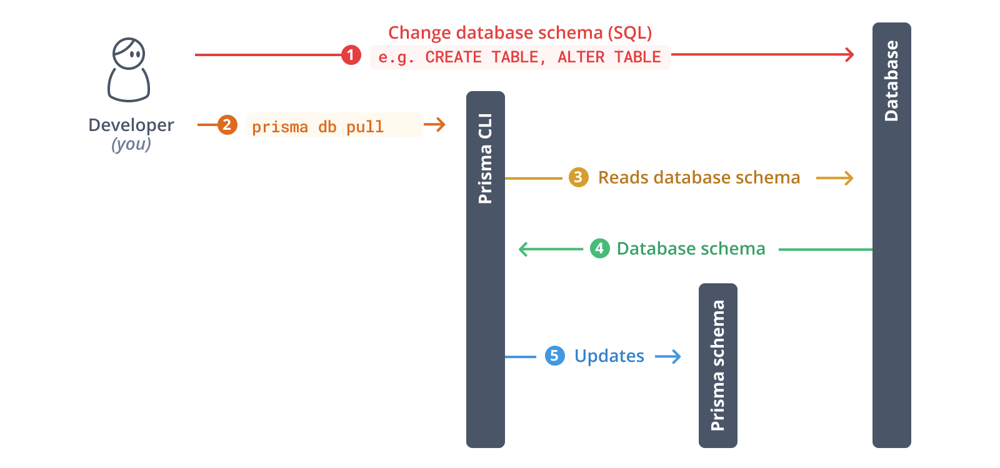

# schema.prisma



<https://www.prisma.io/docs/getting-started/setup-prisma/add-to-existing-project/relational-databases/introspection-typescript-postgresql>

```sh
psql -U postgres -d admindashboard
```

