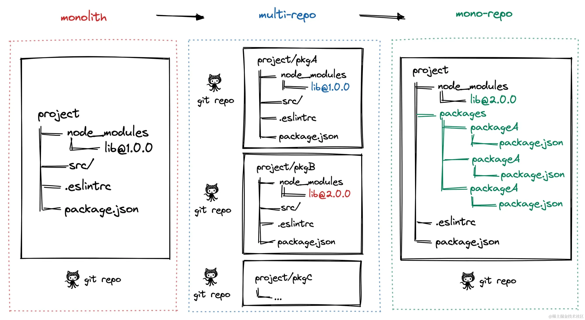

# 发展演进：

git

> 单页面巨石应用 -> 多页面应用(multi-repo) ->  单仓库多模块应用(mono-repo)

## QA
pnpm 如何解决幽灵依赖问题：

1，有workplace做隔离

2，每个包的依赖关系是独立且明确的

3，严格的依赖关系管理：

pnpm 使用一种称为“内容寻址文件系统”的技术来管理依赖关系。每个包的依赖项都被安装到一个全局的存储中，并通过符号链接（symlink）链接到项目中。
这种方式确保每个包只能访问其 package.json 中明确声明的依赖项，防止了幽灵依赖的出现。