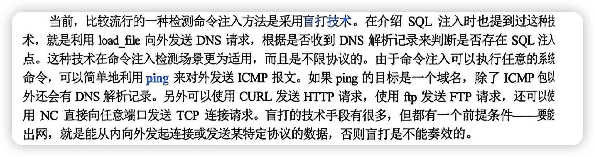

# 远程命令执行

## 反弹shell

bash shell(正向shell,会被服务器拦住)

端口反连技术, 让服务器来连接自己, 一般对于出向的连接策略较为宽松;

本质还是注入, 具体操作不表, 后续去刷题;

注入命令可以藏在http请求的任何角落, 比如CVE-2014-6217

### 盲打技术

前提: 能出网

一般使用有回显的, 比如cat xxx , whoami, ls pwd等等

ps: 对于白盒,(那种php的ctf题), 重点关注可以执行命令的方法

